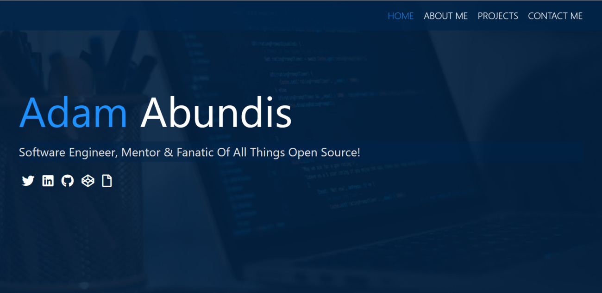

# Adam Abundis Web Developer Portfolio

A simple portfolio written in [HTML](https://www.w3.org/TR/html52/), [Sass](https://sass-lang.com/guide), and [JavaScript](https://developer.mozilla.org/bm/docs/Web/JavaScript)

Demo
-------
Live version: [https://adamabundis.xyz](https://adamabundis.xyz)

Main Technology Stack
-------
* HTML
* CSS Flexbox and Grid 
* CSS Animations
* CSS BEM naming convention
* Sass
* JavaScript
* NPM

License
-------
 The project is available as open source under the terms of the MIT License.