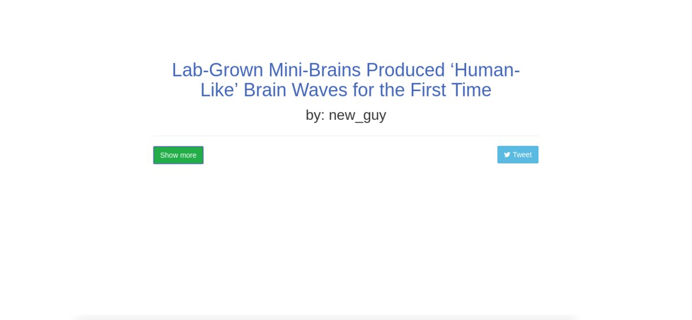

# Adam Abundis Web Developer Portfolio

A simple portfolio written in [HTML](https://www.w3.org/TR/html52/), [Sass](https://sass-lang.com/guide), and [JavaScript](https://developer.mozilla.org/bm/docs/Web/JavaScript)

## Demo

Live version: [https://adamabundis.xyz](https://adamabundis.xyz)

## Main Technology Stack

- HTML
- Sass
- JavaScript
- NPM

## Update

I am starting a new branch (`version-2`) with an updated CSS that features a new look and feel.
I am also using GitHub Projects to document the changes I made in a project setting.
You can find more about [my GitHub kanban board here](https://github.com/abuna1985/dev-portfolio/projects/1)

## License

The project is available as open source under the terms of the MIT License.
